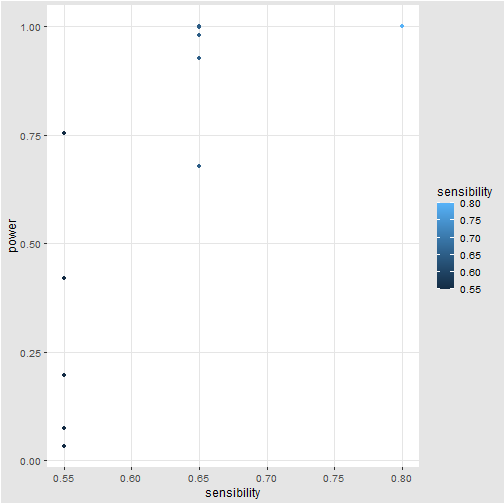
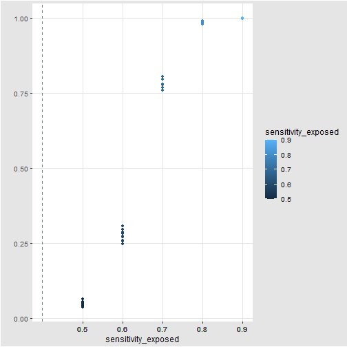
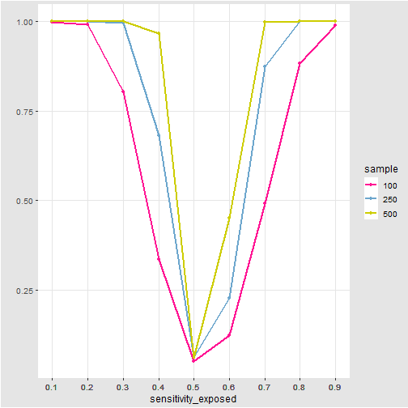
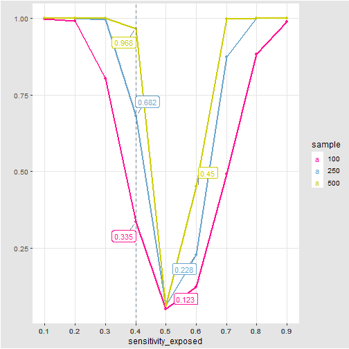

 
# Test Statistc development:

\begin{align}
SE_A &= \tfrac{P_A \times PPV_A}{\pi}\\
\\

&= \tfrac{P_A \times PPV_A}{P_A \times PPV_A + 
                           P_B \times PPV_B -
                           P_{A \cap B} \times PPV_{A \cap B}}\\
                           \\

&=  \tfrac{1}{\frac{P_A \times PPV_A}{P_A \times PPV_A}+
                            \frac{P_B \times PPV_B}{P_A \times PPV_A}-
                            \frac{P_{A \cap B} \times PPV_{A \cap B}}{P_A \times PPV_A}}\\
                            \\
                            
&= \frac{1}{1 +
            \frac{P_B \times PPV_B}{P_A \times PPV_A}-
            \frac{P_{A \cap B} \times PPV_{A \cap B}}{P_A \times PPV_A}}\\
            
\end{align}

then $\frac{SE_A^E}{SE_A^{\bar E}}$ is equal to 1, if and only if:

\begin{equation}
\frac{P^E_B}{P^E_A} \times \frac{PPV^E_B}{PPV^E_A} -
\frac{P^E_{A\cap B}}{P^E_A} \times \frac{PPV^E_{A\cap B}}{PPV^E_A} -
\frac{P^\bar{E}_B}{P^\bar{E}_A} \times \frac{PPV^\bar{E}_B}{PPV^\bar{E}_A} +
\frac{P^\bar{E}_{A\cap B}}{P^\bar{E}_A} \times \frac{PPV^\bar{E}_{A\cap B}}{PPV^\bar{E}_A} = 0
\end{equation}


when the intersection is empty, the **test statistic** is equal to:

\begin{equation}
\frac{P^E_B}{P^E_A} \times \frac{PPV^E_B}{PPV^E_A} -
\frac{P^\bar{E}_B}{P^\bar{E}_A} \times \frac{PPV^\bar{E}_B}{PPV^\bar{E}_A} 
\end{equation}

when the intersection is not empty, the **test statistic** is equal to:

\begin{equation}
\frac{P^E_B}{P^E_A} \times \frac{PPV^E_B}{PPV^E_A} -
\frac{P^E_{A\cap B}}{P^E_A} \times \frac{PPV^E_{A\cap B}}{PPV^E_A} -
\frac{P^\bar{E}_B}{P^\bar{E}_A} \times \frac{PPV^\bar{E}_B}{PPV^\bar{E}_A} +
\frac{P^\bar{E}_{A\cap B}}{P^\bar{E}_A} \times \frac{PPV^\bar{E}_{A\cap B}}{PPV^\bar{E}_A} 
\end{equation}

# Parameters

```r
## starting parameters
N = 20000; prop_exp= 0.2
pi_ne = 0.05; risk = 2
pi_e = pi_ne*risk
    
## validation indices: exposed
SE_A_e=0.7
SE_AintB_e = 0.1
SP_A_e = 0.99
SP_B_e=0.95
    
## validation indices: non-exposed
SE_A_ne=0.5
SE_AintB_ne = 0.1
SP_A_ne = 0.99
SP_B_ne=0.95
```


# Bootstrap

- **sample_size_a** = 100 : size of the original sample (A)

- **sample_size_b** = 100 : size of the original sample (B)

- **na** = 100:  size of the bootstrap sample of A

- **nb** = 100: size of the bootstrap sample of A

- **nboot** = 500: number of statistics calculated in order to perform **one** test

- **nsam** = 1000: number of test performed in order to compute the power


```r
for(i in 1:nsam){

  sam_Ya1 = matrix_A[sample(nrow(matrix_A),sample_size_a),]
  sam_Yb1 = matrix_B[sample(nrow(matrix_B),sample_size_b),]

  for(j in 1:nboot){

    sam_Ya_boot = sam_Ya1[sample(nrow(sam_Ya1), na, replace = TRUE),]
    sam_Yb_boot = sam_Yb1[sample(nrow(sam_Yb1), nb, replace = TRUE),]

    PPV_A_e0[i,j] = (sum(sam_Ya_boot$A==1&sam_Ya_boot$Y==1&sam_Ya_boot$E==1))/
      (sum(sam_Ya_boot$A==1&sam_Ya_boot$E==1))

    PPV_B_e0[i,j] = (sum(sam_Yb_boot$B==1&sam_Yb_boot$Y==1&sam_Yb_boot$E==1))/
      (sum(sam_Yb_boot$B==1&sam_Yb_boot$E==1))

    PPV_A_ne0[i,j] = (sum(sam_Ya_boot$A==1&sam_Ya_boot$Y==1&sam_Ya_boot$E==0))/
      (sum(sam_Ya_boot$A==1&sam_Ya_boot$E==0))

    PPV_B_ne0[i,j] = (sum(sam_Yb_boot$B==1&sam_Yb_boot$Y==1&sam_Yb_boot$E==0))/
      (sum(sam_Yb_boot$B==1&sam_Yb_boot$E==0))

    TX_boot[i,j] = c1*PPV_B_e2[i,j]/PPV_A_e2[i,j]-c2*PPV_B_ne2[i,j]/PPV_A_ne2[i,j] -
      c3*max(PPV_B_e2[i,j],PPV_A_e2[i,j])/PPV_A_e2[i,j] +
      c4*max(PPV_B_ne2[i,j],PPV_A_ne2[i,j])/PPV_A_ne2[i,j]


  }}
```
# Extraction from a binomial


```r
  A = NA
  A = ifelse(Y==1 & E==1, apply(dati, 1, function(SEe){rbinom(1, 1, SE_A_e)}),
        ifelse(Y==1 & E==0, apply(dati, 1, function(SEne){rbinom(1, 1, SE_A_ne)}), 
          ifelse(Y==0 & E==1, apply(dati, 1, function(FPe){rbinom(1, 1, 1-SP_A_e)}), 
            ifelse(Y==0 & E==0, apply(dati, 1, function(FPne){rbinom(1, 1, 1-SP_A_ne)}), A))))
  
  B = NA
  B = ifelse(Y==1 & A==0, apply(dati, 1, function(SE1){rbinom(1, 1, 1)}),
        ifelse(Y==1 & A==1 & E==0, apply(dati, 1, function(SEne){rbinom(1, 1, SE_AintB_ne)}),
          ifelse(Y==1 & A==1 & E==1, apply(dati, 1, function(SEe){rbinom(1, 1, SE_AintB_e)}),
            ifelse(Y==0 & E==1, apply(dati, 1, function(FPe){rbinom(1, 1, 1-SP_B_e)}), 
              ifelse(Y==0 & E==0, apply(dati, 1, function(FPne){rbinom(1, 1, 1-SP_B_ne)}), B)))))
  
  C = NA
  C = A*B
```

## Variability



# Fixed

```r
## Population: Non-Exposed
N_non_exposed=(1-prop_exp)*N
E_0=rep(0,N_non_exposed)
    
    
Y_0_ne=rep(0,N_non_exposed*(1-pi_ne))
Y_1_ne=rep(1,N_non_exposed*pi_ne)
Y_ne=c(Y_1_ne, Y_0_ne)
    
## Population: Exposed
N_exposed=(prop_exp)*N
E_1=rep(1,N_exposed)
Y_0_e=rep(0,N_exposed*(1-pi_e))
Y_1_e=rep(1,N_exposed*pi_e)
Y_e=c(Y_1_e, Y_0_e)
    
## Population: aggregated 
Y=c(Y_e, Y_ne)
E=c(E_1, E_0)
data=data.frame(E,Y)

## Algorithm: A non-exposed
A_TP_ne=rep(1, SE_A_ne*length(Y_1_ne))
A_FN_ne=rep(0, (1-SE_A_ne)*length(Y_1_ne))
A_TN_ne=rep(0, (SP_A_ne)*length(Y_0_ne))
A_FP_ne=rep(1, (1-SP_A_ne)*length(Y_0_ne))
    
A_ne=c(A_TP_ne, A_FN_ne, A_TN_ne, A_FP_ne)
    
## Algorithm: B non-exposed
B_TP_int_ne=rep(1, SE_AintB_ne*length(Y_1_ne))
B_FN_ne=rep(0, (SE_A_ne-SE_AintB_ne)*length(Y_1_ne)) 
B_TP_ne=rep(1, (1-SE_A_ne)*length(Y_1_ne))
B_TN_ne=rep(0, (SP_B_ne)*length(Y_0_ne))
B_FP_ne=rep(1, (1-SP_B_ne)*length(Y_0_ne))
    
B_ne=c(B_TP_int_ne, B_FN_ne, B_TP_ne, B_TN_ne, B_FP_ne)
    
## Algorithm: A exposed
A_TP_e=rep(1, SE_A_e*length(Y_1_e))
A_FN_e=rep(0, (1-SE_A_e)*length(Y_1_e))
A_TN_e=rep(0, (SP_A_e)*length(Y_0_e))
A_FP_e=rep(1, (1-SP_A_e)*length(Y_0_e))
    
A_e=c(A_TP_e, A_FN_e, A_TN_e, A_FP_e)
    
## Algorithm: B exposed
B_TP_int_e=rep(1, SE_AintB_e*length(Y_1_e))
B_FN_e=rep(0, (SE_A_e-SE_AintB_e)*length(Y_1_e))
B_TP_e=rep(1, (1-SE_A_e)*length(Y_1_e))
B_TN_e=rep(0, (SP_B_e)*length(Y_0_e))
B_FP_e=rep(1, (1-SP_B_e)*length(Y_0_e))
    
B_e=c(B_TP_int_e, B_FN_e, B_TP_e, B_TN_e, B_FP_e)
    
## Algorithm: aggregated 
A=c(A_e, A_ne)
B=c(B_e, B_ne)

## Algorithm: C (intersection)
C=ifelse(A==1&B==1, 1 , 0)
    
data=data.frame(E, Y, A, B, C)
```


## Variability





# Results
Power of bootstrap test for non-differentiality for three different sample sizes 





# To check

## Correction 


```r
  for(i in 1:nsam){
    
    sam_Ya_boot = sam_Ya1[sample(nrow(sam_Ya1), n, replace = TRUE),]
    sam_Yb_boot = sam_Yb1[sample(nrow(sam_Yb1), nb, replace = TRUE),]
    
    for(j in 1:nboot){
      
      PPV_B_e2[i,j] = ifelse( PPV_B_e0[i,j]>0 & (!is.na(PPV_B_e0[i,j])) & PPV_B_e0[i,j] != Inf, 
                              PPV_B_e0[i,j],  1/(2*sum(sam_Yb_boot$B==1&sam_Yb_boot$E==1)))
      
      PPV_A_e2[i,j] = ifelse( PPV_A_e0[i,j]>0 & (!is.na(PPV_A_e0[i,j])) & PPV_A_e0[i,j] != Inf,
                              PPV_A_e0[i,j],  1/(2*sum(sam_Ya_boot$A==1&sam_Ya_boot$E==1)))
      
      PPV_B_ne2[i,j] = ifelse( PPV_B_ne0[i,j]>0 & (!is.na(PPV_B_ne0[i,j])) & PPV_B_ne0[i,j] != Inf, 
                               PPV_B_ne0[i,j],  1/(2*sum(sam_Yb_boot$B==1&sam_Yb_boot$E==0)))
      
      PPV_A_ne2[i,j] = ifelse( PPV_A_ne0[i,j]>0 & (!is.na(PPV_A_ne0[i,j])) & PPV_A_ne0[i,j] != Inf,
                               PPV_A_ne0[i,j],  1/(2*sum(sam_Ya_boot$A==1&sam_Ya_boot$E==0)))
      
      TX_boot2[i,j] = c1*PPV_B_e2[i,j]/PPV_A_e2[i,j]-c2*PPV_B_ne2[i,j]/PPV_A_ne2[i,j]
      
    }
  }
```

## Asymmetry



